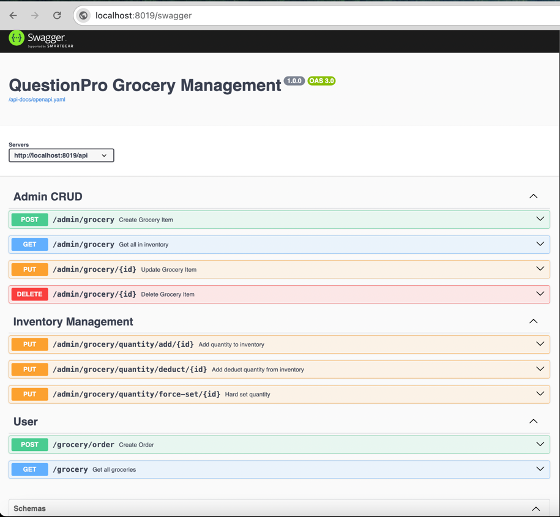

### Setup:

1. npm install: `npm i --include=dev`
2. Change your DB details in .env and config/locdev.json files
3. For DB migration, run: `prisma db push`
4. Start server(dev mode) by running: `npm run dev`
5. See available endpoints at `http://localhost:8019/swagger`:
    
    
   

### Tech and Libraries used:

1. TypeScript
2. Express
3. Prisma ORM
4. config, winston, morgan, swagger
5. ESLint
